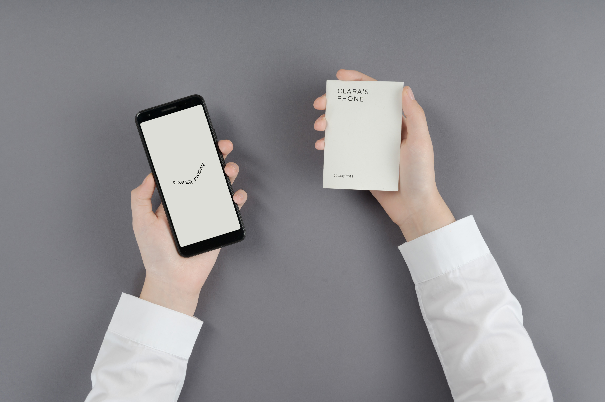

# Paper Phone

A printable Paper Phone which helps you take a break away from your digital world

A lot of people feel that they spend too much time on their phones and struggle to find a balance with technology.

Paper Phone helps you have a little break away from your digital world by printing a personal booklet of the key information you’ll need that day. 

An app lets you choose what to include such as favourite contacts, maps and meetings and then prints them directly to a sheet of paper. 

Customisable “paper apps” like recipes, phrasebooks and notepads let you get things done or unwind in a more focussed way. 

We hope this little experiment can help you try a digital detox from technology and help you focus on the things that matter the most.

Paper Phone is an experimental open source Android app which is available to try right now. All of the code is available on Github for people to play with and hopefully adapt and evolve! 

[Try the app on the Google Play Store](https://play.google.com/store/apps/details?id=com.withgoogle.experiments.unplugged)

[Special Projects](www.specialprojects.studio)
